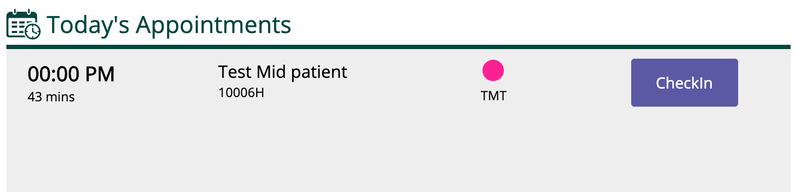
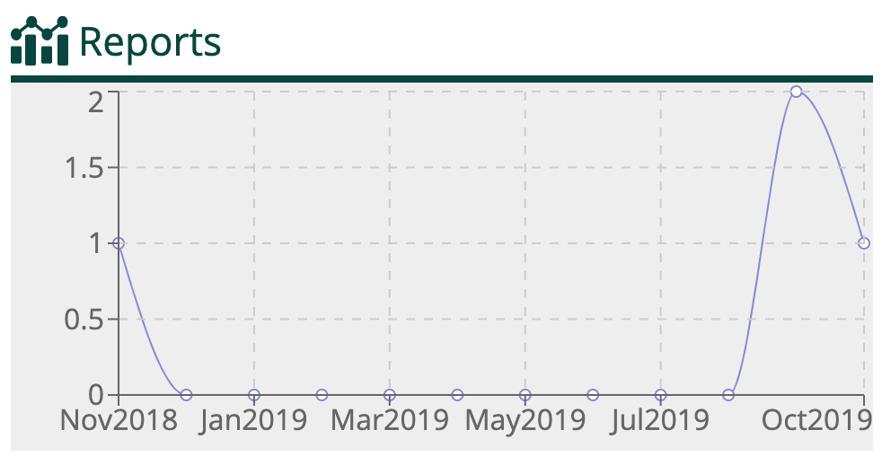

# User Dashboard Widgets

ESM Package serves widgets for OpenMRS Dashboard Engine.

## Available Widgets

- Todo

- Appointment

- Charts

- Reports

## Pre-Requisites

NodeJS

## How to Setup?

- Run `npm install` to install all the dependencies

- Run `npm start -- --https --port 8082` to start application in dev mode.

- If you are using with OpenMRS Micro Frontend, update/add the port:url in `import-map.json` file of `openmrs-esm-root-config`.

- Run `npm run build` for production build.

## Widgets

- Appointments
- Charts
- Todos
- Reports

## Appointments

This widget shows the list of appointments. It also allows the user to perform various actions like checkin, confirm.

Please refer the [Architecture Decision Record](docs/adr-03-appointment-configuration.md) for more information about how to configure an appointment widget.

### Sample screenshots

#### Appointments

#### Todo's

[!Todo's](./screenshots/todo.png "Todo's"))

#### Charts

## Charts

This widget shows the charts based on the configuration. Refer below to check list of chart types supported.

Please refer the [Architecture Decision Record](docs/adr-04-charts-configuration.md) for more information about how to configure a chart widget.

### Chart Types

- LineChart

## Reports

This widget shows the chart or table based on the configuration.

Please refer the [Architecture Decision Record](docs/adr-05-reports-configuration.md) for more information about the configure a report widget.
